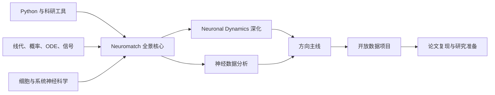

# 计算神经科学自学路线图

> 版本：v0.1（研究准备版）  
> 链接核验日期：2026-07-14  
> 适用对象：本科生、研究生，以及从计算机/AI、数学/物理、生物/医学、心理/认知科学转入计算神经科学的自学者  
> 默认强度：每周 8–12 小时，约 64 周；文末另有 24 周速通版与 18–24 个月深入版  
> 说明：英文领域名通常写作 **computational neuroscience**，中文一般译作“计算神经科学”。

## 0. 如何使用这份路线图

这份整理借鉴 [CS 自学指南](https://csdiy.wiki/) 的组织逻辑：不只罗列课程，而是给出先修依赖、主线课程、配套教材、作业/项目、完成标准、进阶分支和自学建议。它是一份可执行的“培养方案”，不是资源百科。

### 0.1 标签

- **[核心]**：以科研入门为目标时应完成。
- **[推荐]**：强烈建议，但可按背景替换或压缩。
- **[选修]**：只在对应研究方向需要时学习。
- **[开放]**：主要教学材料可免费在线访问；直播班、证书或纸书可能收费。
- **[平台制]**：Coursera/edX 等平台的旁听、作业和证书政策会变化，以页面当日说明为准。
- **[图书]**：通常需购买或通过图书馆访问，除非另行注明有作者公开版。

### 0.2 最重要的使用原则

1. 每个阶段只选 **1 个主课程 + 1 本参考书 + 1 个项目**。不要同时“刷”所有资源。
2. 学习时间至少一半用于推导、编程、作业和解释结果；视频不是学习成果。
3. 始终把问题分成三类：**描述/预测（what）**、**机制（how）**、**规范性解释（why）**。预测准确不等于找到了生物机制。
4. 所有模型都要有基线、训练/测试隔离、不确定性、失效条件和生物学解释。
5. 每 8–12 周产出一个公开、可复现的小项目，而不是等“全部学完”才开始研究。

### 0.3 如果只想知道最简主线

按顺序完成下面四件事，已经是一条质量很高的入门路线：

1. [Neuromatch 先修材料](https://compneuro.neuromatch.io/prereqs/ComputationalNeuroscience.html)：补 Python、线代、微积分/ODE、统计和基础神经科学。
2. [Neuromatch Computational Neuroscience 课程书](https://compneuro.neuromatch.io/)：建立模型拟合、GLM、降维、动力系统、Bayes、隐状态、强化学习和因果的全景。
3. [EPFL《Neuronal Dynamics》](https://neuronaldynamics.epfl.ch/online/)：把单神经元、脉冲统计、网络与认知动力学学深，并完成配套 Python 练习。
4. 用 [Allen Visual Coding Neuropixels](https://allensdk.readthedocs.io/en/stable/visual_coding_neuropixels.html)、[IBL](https://www.internationalbrainlab.com/data) 或 [DANDI](https://docs.dandiarchive.org/) 做一个开放数据项目，再复现一篇论文中的一张关键图。

---

## 1. 先建立正确的学科地图

计算神经科学不是“把深度学习用在脑数据上”，也不只是“模拟很多神经元”。它研究神经系统在不同尺度上如何表示、变换、学习和使用信息，并用数学模型、统计推断、仿真和实验数据检验理论。

| 尺度 | 典型问题 | 常用模型/数学 | 常见数据 |
|---|---|---|---|
| 离子通道、树突、单细胞 | 动作电位如何产生？树突如何整合输入？ | 电路、ODE/PDE、Hodgkin–Huxley、多室模型 | patch clamp、形态重建 |
| 突触与局部回路 | E/I 平衡、振荡、可塑性如何产生？ | LIF/AdEx、随机过程、网络仿真、均场 | 多电极、Neuropixels、钙成像 |
| 群体与系统 | 刺激、动作、选择如何由群体活动编码？ | GLM、Bayes、状态空间、降维、动力系统 | spikes、LFP、ECoG、2-photon |
| 行为与认知 | 感知、决策、学习和记忆采用什么计算？ | DDM、RL、HMM、最优控制、RNN | 行为、眼动、神经活动 |
| 区域/全脑 | 结构连接如何约束全脑动态？ | 图论、neural mass、网络控制、生成模型 | EEG/MEG、fMRI、dMRI、连接组 |
| NeuroAI | 自然与人工智能共享什么计算原则？ | ANN/RNN/Transformer、表征比较、benchmark | 模型激活、神经与行为数据 |

### 1.1 三个互补视角

- **规范性（why）**：系统为什么应采用某种计算？例如最优估计、Bayesian inference、reward maximization。
- **算法/表征（what）**：输入怎样变成输出，信息以什么变量表示？例如 population code、state-space、RL update。
- **机制/实现（how）**：细胞、突触与回路怎样实现该计算？例如 recurrent attractor、E/I circuit、plasticity rule。

优秀项目会明确自己处于哪一层，并说明它能与不能支持什么结论。

### 1.2 依赖关系



---

## 2. 入门诊断与背景适配

### 2.1 诊断清单

能独立完成或清楚解释下列任务，才算具备相应先修。不会并不妨碍开始，只决定第 1 阶段要花多少时间。

**编程**

- 用 Python 函数和 NumPy 数组模拟一个随时间更新的状态变量。
- 读写表格/数组，画折线、散点、直方图和 raster/PSTH。
- 使用虚拟环境、Jupyter、Git；能从 README 重跑自己的项目。

**数学**

- 解释矩阵乘法、投影、特征值/特征向量、SVD/PCA 的几何意义。
- 解一阶线性 ODE；用 Euler 或 `solve_ivp` 数值求解，并检查步长误差。
- 熟悉条件概率、Bayes、期望/方差/协方差、Gaussian 与 Poisson。
- 理解 likelihood、MLE/MAP、回归、交叉验证、bootstrap。
- 理解采样率、卷积、Fourier transform、滤波与频谱泄漏的基本概念。

**神经科学**

- 解释静息电位、动作电位、突触传递、兴奋/抑制、receptive field。
- 区分 spikes、LFP、EEG/MEG、fMRI、钙成像测到的量与时间/空间尺度。
- 知道相关、解码准确率和因果机制不是一回事。

### 2.2 按背景调整

| 既有背景 | 可压缩 | 必须补强 | 建议总时长 |
|---|---|---|---:|
| CS / AI / 数据科学 | Python、基础线代、基础 ML | 细胞神经生理、实验测量、ODE/动力系统、层级统计 | 9–15 个月 |
| 数学 / 物理 / 工程 | 微积分、线代、ODE | 神经生物学、统计建模、真实数据 QC 与实验限制 | 9–15 个月 |
| 生物 / 神经科学 / 医学 | 神经解剖与生理 | Python、线代、概率统计、ODE、可复现工程 | 12–20 个月 |
| 心理 / 认知科学 | 行为范式、部分统计 | Python、神经生理、动力系统、神经数据模态 | 12–20 个月 |
| 完全零基础 | 无 | 全部按标准路线 | 18–24 个月 |

### 2.3 何时可以跳过先修

不要按“上过课”判断，要按输出判断。若你能在 2–3 小时内从方程实现 LIF neuron、对参数做 sweep、画出结果、解释数值误差并提交一个可重跑仓库，就可压缩 Python/ODE 基础；若做不到，就完成对应先修。

---

## 3. 64 周标准路线（每周 8–12 小时）

| 阶段 | 周数 | 核心目标 | 阶段产出 |
|---|---:|---|---|
| 0. 工具与定向 | 1–2 | 建立科研计算工作流 | LIF 小仓库 |
| 1. 数学与神经科学桥梁 | 3–14 | 补足线代、ODE、概率、信号、神经生理 | 4 个基础 notebook |
| 2. 计算神经科学全景 | 15–26 | 完成 Neuromatch 核心模块 | 一个模型/数据 mini-project |
| 3. 神经元与网络动力学 | 27–38 | 用《Neuronal Dynamics》建立机制深度 | 单细胞到网络模型报告 |
| 4. 神经数据科学 | 39–50 | 独立完成真实数据分析 | 开放数据项目 v1 |
| 5. 专题主线 | 51–58 | 选择一个研究方向深入 | 专题项目或论文图复现 |
| 6. 研究型 capstone | 59–64 | 完成可复现研究闭环 | 仓库、短论文、演示 |

### 阶段 0：工具与定向（第 1–2 周）

**定位**：把“能运行 notebook”升级为“别人能重现结果”。

**核心资源**

- [Neuromatch Python Workshop 1/2](https://compneuro.neuromatch.io/tutorials/Schedule/schedule_intro.html) [核心][开放]
- [Software Carpentry：Shell、Git、Python](https://swcarpentry.github.io/) [推荐][开放]
- [MIT Missing Semester 2026](https://missing.csail.mit.edu/)：选择 Shell、开发环境、调试、Git、代码质量 [推荐][开放]
- [Python Data Science Handbook](https://jakevdp.github.io/PythonDataScienceHandbook/)：NumPy、pandas、Matplotlib、scikit-learn 查漏 [参考][开放]

**本阶段只需掌握**

- Python：函数、数组广播、随机数、文件 I/O、绘图、简单类。
- 科学栈：NumPy、SciPy、pandas、Matplotlib/Seaborn、Jupyter、scikit-learn。
- 工程：环境文件、Git、README、相对路径、随机种子、基本测试。
- 不必先学 C++、CUDA、复杂软件架构或大规模集群。

**项目 P0：LIF neuron 最小仓库**

1. 从膜电位 ODE 写出 Euler 与 `solve_ivp` 两个版本。
2. 输入 step current 与 noisy current，画膜电位和 spike times。
3. sweep 输入电流，画 f–I curve；比较两个积分器与不同步长。
4. 仓库包含 `README.md`、环境文件、`src/`、`notebooks/`、`tests/`。

**完成标准**

- 在全新环境按 README 可复现全部图。
- 能解释时间常数、阈值、reset、refractory period 各自改变什么。
- 知道数值结果可能依赖步长，且实际检查过。

### 阶段 1：数学与神经科学桥梁（第 3–14 周）

#### 第 3–4 周：线性代数

**必须会**：向量/矩阵、basis、rank、projection/least squares、eigendecomposition、SVD、positive definite matrix、PCA。

- 主修：[Neuromatch Linear Algebra refresher](https://compneuro.neuromatch.io/tutorials/W0D3_LinearAlgebra/student/W0D3_Intro.html) [核心][开放]
- 补弱：[MIT 18.06SC Linear Algebra](https://ocw.mit.edu/courses/18-06sc-linear-algebra-fall-2011/)；重点看 subspace、projection/least squares、eigen、SVD，不必逐课全刷 [推荐][开放]
- 紧凑书：[Mathematics for Machine Learning](https://mml-book.github.io/) 第 2–4、10 章 [推荐][开放]

**产出**：不用 `sklearn.PCA`，从中心化、SVD 到投影重建实现 PCA；解释每个主成分方差与重建误差。

#### 第 5–7 周：微积分、ODE 与数值方法

**必须会**：导数/积分、Taylor expansion、gradient/Jacobian、线性 ODE、fixed point、局部稳定性、Euler/Runge–Kutta、phase plane。

- 主修：[Neuromatch Calculus refresher](https://compneuro.neuromatch.io/tutorials/W0D4_Calculus/student/W0D4_Intro.html) [核心][开放]
- 补弱：[MIT 18.03SC Differential Equations](https://ocw.mit.edu/courses/18-03sc-differential-equations-fall-2011/)；选择一阶 ODE、线性系统、相图、稳定性 [推荐][开放]
- 深化前置：[MIT Computational Tutorial: Dynamical Systems in Neuroscience](https://ocw.mit.edu/courses/res-9-008-brain-and-cognitive-sciences-computational-tutorials/pages/12-dynamical-systems-in-neuroscience/) [选修][开放]

**产出**：为二维线性系统计算 eigenvalues、画 vector field/trajectory；用解析与数值结果交叉检查。

#### 第 8–10 周：概率与统计

**必须会**：条件概率、Bayes、常见分布、期望/方差/协方差、LLN/CLT、likelihood、MLE/MAP、bootstrap、假设检验与效应量、线性/逻辑/Poisson 回归。

- 主修：[Neuromatch Statistics refresher](https://compneuro.neuromatch.io/tutorials/W0D5_Statistics/student/W0D5_Intro.html) [核心][开放]
- 系统补弱：[Harvard Stat 110](https://stat110.hsites.harvard.edu/)；优先条件概率、Poisson/Gaussian、joint distribution、covariance、LLN/CLT、Markov chain [推荐][开放]
- 书：Blitzstein & Hwang, *Introduction to Probability*，Stat 110 页面提供开放电子版 [推荐]

**产出**：模拟 Poisson spike train，验证均值/方差与计数窗关系；bootstrap firing-rate difference 的置信区间。

#### 第 11 周：信号与系统

**必须会**：采样/aliasing、卷积、线性滤波、Fourier transform、power spectrum、时频分析，以及滤波边界效应。

- 主修：[Neuromatch 总日程中的 Signal Processing 单元](https://compneuro.neuromatch.io/tutorials/Schedule/schedule_intro.html) [核心][开放]。课程书会随版本调整单元路径，因此从总日程进入最稳妥。

**产出**：构造含两个频率和噪声的信号，演示采样、滤波、FFT 与 spectrogram；解释参数选择造成的偏差。

#### 第 12 周：优化与信息论

**必须会**：gradient descent、loss 与 likelihood、regularization、entropy、mutual information、KL divergence 的意义。

- 快速入口：Neuromatch model fitting/GLM 的相关前置。
- 深化：[David MacKay, *Information Theory, Inference, and Learning Algorithms*](https://www.inference.org.uk/itprnn/book.pdf) 选读第 1–4、8–10 章 [选修][开放阅读]
- 课程：[MIT 6.050J Information and Entropy](https://ocw.mit.edu/courses/6-050j-information-and-entropy-spring-2008/) [选修][开放]

**产出**：从 likelihood 推导 Gaussian linear regression 或 Poisson GLM 的目标函数；数值验证正则化的 bias–variance trade-off。

#### 第 3–14 周并行：基础神经科学，每周 2 小时

**推荐二选一，不要全部完成：**

- 路线 A（直观、交互）：[HarvardX Fundamentals of Neuroscience](https://www.edx.org/learn/neuroscience/harvard-university-fundamentals-of-neuroscience-part-1-the-electrical-properties-of-the-neuron) Part 1–3 [推荐][平台制]；若部分单元已归档，则用下面的 UTHealth 开放教材补齐。
- 路线 B（开放教材）：[UTHealth Neuroscience Online](https://nba.uth.tmc.edu/neuroscience/m/index.htm)；重点 Section 1、感觉系统、运动、学习记忆 [推荐][开放]。
- 极简复习：[Neuromatch Neuro Video Series](https://compneuro.neuromatch.io/tutorials/W0D0_NeuroVideoSeries/student/W0D0_Intro.html) [核心][开放]。
- 更严谨但更重：[Duke Medical Neuroscience](https://www.coursera.org/learn/medical-neuroscience) [选修][平台制]。
- 课程式材料：[MIT 9.01 Introduction to Neuroscience](https://ocw.mit.edu/courses/9-01-introduction-to-neuroscience-fall-2007/) [选修][开放]。

**必须掌握的生物主题**

- 膜、电容、电导、Nernst/reversal potential、动作电位。
- chemical/electrical synapse，EPSP/IPSP，短时与长时可塑性。
- 感觉与运动通路、receptive field、population coding。
- spikes/LFP/EEG/MEG/fMRI/calcium imaging 各自的测量对象、分辨率和主要混杂。

**阶段 1 总过关标准**

- 能从 RC circuit 推出 LIF 方程并解释参数单位。
- 能判断二维系统固定点的局部稳定性。
- 能解释为什么 spike count 常用 Poisson/overdispersed 模型、为什么神经数据不能随意打乱 trial/animal 做交叉验证。
- 能给非专业同学解释任意一种神经测量技术“实际测到了什么”。

### 阶段 2：计算神经科学全景（第 15–26 周）

**主修唯一选择**：[Neuromatch Academy Computational Neuroscience 课程书](https://compneuro.neuromatch.io/) [核心][开放]。

直播课程把内容压缩在约三周；自学建议展开成 12 周：

| 周 | 模块 | 必做内容 | 小产出 |
|---:|---|---|---|
| 15 | Model Types / Modeling Practice | what/how/why 模型；把问题转成可证伪预测 | 一页 modeling proposal |
| 16 | Model Fitting | MSE、MLE、bootstrap、bias–variance、cross-validation | 拟合与不确定性 notebook |
| 17 | GLM | encoding、classification、regularization | Poisson GLM 编码模型 |
| 18 | Dimensionality Reduction | PCA、重建、非线性降维 | 群体轨迹与重建误差 |
| 19 | Deep Learning | decoding、CNN、normative encoding | 线性基线 vs 小型 NN |
| 20 | Signal Processing | sampling、FFT、filter、time-frequency | LFP/EEG 风格信号分析 |
| 21 | Linear Systems | LDS、Markov、AR、确定性+随机性 | 稳定性与轨迹 |
| 22 | Biological Neuron Models | LIF、相关输入、动态突触、STDP | 单元模型比较 |
| 23 | Dynamical Systems | rate model、Wilson–Cowan | E/I 相图与参数扫掠 |
| 24 | Bayesian Decisions | 离散/连续隐变量、utility | Bayesian observer |
| 25 | Hidden Dynamics | SPRT、HMM、Kalman、EM | 隐状态恢复 |
| 26 | RL + Network Causality | TD/bandit/Q-learning；干预、工具变量 | RL 或因果 mini-project |

**学习方法**

- 每个 tutorial 先自己预测图形和结果，再运行代码。
- 隐藏参考答案或从空 notebook 重写核心函数；至少保留一个简单 baseline。
- 每周写一页：科学问题、模型假设、参数、观测、评价、可能失败方式。

**项目 P1：Neuromatch mini-project**

可从课程的 [Datasets and Project Templates](https://compneuro.neuromatch.io/projects/docs/project_guidance.html) 选择 neurons、fMRI、ECoG 或 behavior/theory 数据，也可完成下面任一题：

- 用 GLM 预测 spike count，并与均值模型、ridge/Poisson 基线比较。
- 用 Wilson–Cowan 模型预测参数改变引起的稳态/振荡转变。
- 用 HMM 恢复行为策略切换，检查 parameter recovery。
- 用 Bayesian observer 或 RL 模型拟合行为，并做 posterior predictive check。

**完成标准**

- 明确 train/validation/test 或 cross-validation unit。
- 有 uncertainty、null/baseline、失败结果与限制，不只报告最好分数。
- 能把模型写成“输入—隐变量—参数—观测—预测”的生成过程。

### 阶段 3：神经元与网络动力学（第 27–38 周）

**主教材**：[Gerstner et al., *Neuronal Dynamics*](https://neuronaldynamics.epfl.ch/online/) [核心][开放在线阅读]。官网同时提供 [Python exercises](https://neuronaldynamics-exercises.readthedocs.io/en/latest/) 和 [15 周教学材料/视频入口](https://neuronaldynamics.epfl.ch/lectures.html)。

| 周 | 章节 | 重点 | 建议实现 |
|---:|---|---|---|
| 27 | Ch.1 | LIF、filter 视角、模型限制 | LIF、脉冲/周期/噪声输入 |
| 28 | Ch.2 | Nernst、HH、离子通道 | HH 与 f–I curve |
| 29 | Ch.3 | 突触、cable、compartment | passive cable 或 ball-and-stick |
| 30 | Ch.4 | 降维、nullcline、稳定性、bifurcation | 2D phase plane |
| 31 | Ch.5–6 | EIF/QIF/AdEx、adaptation、firing patterns | 三种简化模型比较 |
| 32 | Ch.7 | spike variability、PSTH、CV、renewal、neural code | spike-train statistics |
| 33 | Ch.8–11 | noise、likelihood、GLM、encoding/decoding | LNP/GLM 与 goodness-of-fit |
| 34 | Ch.12 | population、connectivity、balanced E/I | 随机 E/I 网络 |
| 35 | Ch.15 | rate model、网络响应 | rate vs spiking 比较 |
| 36 | Ch.16 | competition、decision、DDM | decision circuit |
| 37 | Ch.17–18 | Hopfield、working memory、neural field/bump | attractor network |
| 38 | Ch.19–20 | Hebb/STDP/reward learning、plastic network | STDP 或 reward-modulated rule |

**按方向裁剪**

- 数据/编码方向：精读 7、9–11；1–6 只做基本模型，13–15 可后置。
- 生物物理方向：精读 1–6，另学 NEURON；7–11 与 12 必须保留。
- 网络/动力学方向：精读 4、12–20；13–14 属进阶数学，可第二遍再学。
- 认知/决策方向：保留 7、10–12、15–20，并配合行为模型。

**项目 P2：从单细胞到网络**

至少完成四项中的三项：

1. LIF、EIF/AdEx、HH 在准确性、参数量和计算成本上的比较。
2. Wilson–Cowan 或 conductance-based E/I 网络的解析稳定性与数值模拟一致性。
3. Hopfield、ring/bump 或 decision attractor 的容量/鲁棒性/噪声分析。
4. 复现《Neuronal Dynamics》一张图，并做一个原文没有的参数扰动。

**完成标准**

- 不只会画轨迹：能从方程找 fixed point、计算 Jacobian/eigenvalues，并解释局部稳定性。
- 报告模型层次、单位、积分器、步长、初值、随机种子和参数来源。
- 解释“更生物真实”为什么不自动意味着“更好的科学模型”。

### 阶段 4：神经数据科学（第 39–50 周）

**主线资料**

- Neuromatch 的 Model Fitting、GLM、Dimensionality Reduction、Signal Processing、Hidden Dynamics [核心][开放]。
- Kramer & Eden, [*Case Studies in Neural Data Analysis*](https://mitpress.mit.edu/9780262529372/case-studies-in-neural-data-analysis/)；官网链接数据与代码 [推荐][图书]。
- Kass, Eden & Brown, [*Analysis of Neural Data*](https://link.springer.com/book/10.1007/978-1-4614-9602-1)，[作者代码/数据站](https://www.stat.cmu.edu/~kass/KEB/) [进阶][图书]。
- 《Neuronal Dynamics》Ch.7、9–11 [核心]。

| 周 | 主题 | 必做检查 |
|---:|---|---|
| 39 | 实验设计与数据模态 | unit of analysis、trial/session/animal 层级、混杂 |
| 40 | QC、EDA 与不确定性 | 缺失、artifact、effect size、bootstrap/hierarchical CI |
| 41 | spikes 与 point process | raster、PSTH、ISI/CV/Fano、Poisson/renewal |
| 42 | tuning/receptive field/encoding | STA/LNP/GLM、regularization、goodness-of-fit |
| 43 | decoding | leakage-free split、calibration、null、跨 session 泛化 |
| 44 | population analysis | PCA、trajectory、latent/state-space、稳定性 |
| 45 | LFP/EEG/连续信号 | filter、PSD、time-frequency、event alignment |
| 46 | 数据标准 | NWB/BIDS、metadata、provenance、license/citation |
| 47 | 开放数据访问 | 先取 1 session/subject，建立 data manifest |
| 48 | 研究问题与 baseline | 预先写评价、失败标准和 sanity checks |
| 49 | 主分析与 robustness | 多切分、参数敏感性、negative control |
| 50 | 报告与复现 | clean environment 重跑，2–4 页短报告 |

**推荐数据项目，四选一**

1. **Allen Neuropixels**：从官方 [quick start/tutorials](https://allensdk.readthedocs.io/en/stable/visual_coding_neuropixels.html) 开始，做 unit QC、PETH/tuning、刺激或行为 decoding、PCA trajectory。
2. **IBL Brain-Wide Map**：从 [数据页与 ONE 教程](https://www.internationalbrainlab.com/data) 开始，比较不同脑区的 choice/stimulus/feedback encoding。
3. **DANDI/NWB**：用 [2026 Quick Start](https://docs.dandiarchive.org/example-notebooks/tutorials/open_data_quick_start_2026/Get-to-know-a-Dandiset/) 选择小型 ephys/ophys 数据，学习 streaming、metadata 与分析。
4. **OpenNeuro**：选一个小型 BIDS EEG/fMRI 数据集；EEG 用 MNE，fMRI 用 Nilearn。不要把预处理和神经解释混为一谈。

**项目 P3 的最低分析闭环**

```text
数据来源/许可 → 质量控制 → 时间/事件对齐 → 预先定义特征
→ 简单基线 → 主模型 → held-out 评价 → uncertainty/null
→ robustness/敏感性 → 神经科学解释与限制
```

**完成标准**

- 数据切分匹配研究问题：至少考虑 trial、session、animal，不能把相关样本随机打散造成泄漏。
- 明示 QC threshold，并做阈值敏感性分析。
- 报告简单基线、null distribution、uncertainty；适用时报告 noise ceiling。
- 分清 prediction、association 与 causality。

### 阶段 5：专题主线（第 51–58 周）

只选择文档第 5 节中的 **一条主纵线**，再选一条支撑横线。例如：

- 偏理论：动力系统主线 + 编码/数据横线。
- 偏神经数据：大规模数据分析主线 + encoding/modeling 横线。
- 偏认知：学习/决策主线 + dynamics/RNN 横线。
- 偏 NeuroAI：NeuroAI 主线 + 感知/population analysis 横线。
- 偏生物物理：NEURON/细胞建模主线 + 动力系统横线。

八周内完成专题核心资料、一个小型复现和一个原创扰动/扩展。不要在这一阶段同时学习多个 simulator 或所有数据模态。

### 阶段 6：研究型 capstone（第 59–64 周）

| 周 | 工作 | 可验证产出 |
|---:|---|---|
| 59 | 选论文/问题，写 scope、预测、评价和失败标准 | 1–2 页 proposal |
| 60 | 获取数据/代码，复现环境与最简单 baseline | data manifest + baseline |
| 61 | 复现一张关键图或一个核心数值 | reproduction figure |
| 62 | robustness、ablation、parameter recovery 或跨数据泛化 | sensitivity/null results |
| 63 | 整理代码、测试、方法和局限 | release candidate |
| 64 | clean-room 重跑、短论文、10 分钟演示 | v1.0 release |

**统一交付物**

1. README：科学问题、数据/模型来源、运行命令、预期耗时。
2. 锁定环境；数据用 acquisition script 或 manifest，不把 TB 级原始数据塞进 Git。
3. 核心函数放 `src/` 并有少量测试；notebook 主要用于探索与展示。
4. 一项公开结果/图的复现，以及一项参数扰动、ablation 或新假设。
5. held-out evaluation、uncertainty、null/baseline；适用时 noise ceiling。
6. 2–4 页短报告：question、method、result、limitations、next experiment。

**研究准备通关 rubric**

- 能明确模型是 descriptive、normative 还是 mechanistic。
- 能从零推导并实现一个简单 baseline。
- 能进行无泄漏切分并量化 uncertainty。
- 能区分预测、相关和因果。
- 能在干净环境中复现结果。
- 能说明 identifiability、failure mode，以及什么实验可以区分竞争模型。

---

## 4. 24 周速通版与 18–24 个月深入版

### 4.1 24 周速通版（每周 12–18 小时）

适合已有 Python、线代、微积分、概率基础的人；目标是“能读论文、做一个小项目”，不是替代系统训练。

| 周 | 内容 |
|---:|---|
| 1–2 | Neuromatch 先修诊断 + Neuro Video Series + LIF 项目 |
| 3–10 | Neuromatch 核心：model fitting、GLM、PCA、signal、LDS、biological neuron、dynamics、Bayes/HMM/RL |
| 11–16 | 《Neuronal Dynamics》精选：1–4、7、10–12、15–19 |
| 17–20 | Allen/IBL/DANDI 真实数据分析 |
| 21–24 | 论文图复现、robustness、报告和发布 |

### 4.2 18–24 个月深入版

- 先完整完成 64 周路线。
- 再花 3–6 个月精读一个高级教材并做题，如 Izhikevich、Ermentrout & Terman、Kass/Eden/Brown。
- 再花 3–6 个月做第二模态/第二专题、贡献开源项目、参加 reading group，并申请暑校或实验室 rotation。

### 4.3 每周时间模板

| 活动 | 时间 | 原则 |
|---|---:|---|
| 视频/讲义 | 2 h | 只记问题、假设和关键推导 |
| 教材/论文 | 2 h | 主动推导，不追求从头到尾 |
| 编程/作业 | 4–5 h | 从空白实现、做 baseline 与检查 |
| 复盘/写作 | 1 h | 一页总结或一次口头讲解 |
| 项目维护/讨论 | 1–2 h | Git、issue、code review、reading group |

---

## 5. 专题分支：共同核心之后怎么选

每条主线默认 8–12 周。选择标准不是“哪个最热门”，而是你想解释的现象、可获得的数据和想进入的实验室。建议采用 **1 条主纵线 + 1 条方法横线**。

### 5.1 细胞、生物物理与多室模型

**适合**：关注离子通道、树突计算、细胞类型、疾病机制、药理或细胞级仿真的学习者。

**先修**：《Neuronal Dynamics》Ch.1–6；电路、ODE、基础电生理；Python。

**主资源**

- Sterratt et al., [*Principles of Computational Modelling in Neuroscience*, 2e](https://www.cambridge.org/highereducation/books/principles-of-computational-modelling-in-neuroscience/17D6BDB0AF15FAD5B9341132B6A706BF) [主教材][图书]。
- Koch, [*Biophysics of Computation*](https://academic.oup.com/book/40820) [进阶参考][图书]。
- [NEURON + Python tutorials](https://neuron.yale.edu/neuron/static/docs/neuronpython/index.html) 与 [NEURON course exercises](https://neuron.yale.edu/neuron/docs/neuron-course-exercises) [核心][开放]。
- [ModelDB](https://modeldb.science/)：查找与论文关联的可运行模型 [核心][开放]。

**工具选择**

- 单细胞、多室、形态和 ion channel：**NEURON**。
- 多尺度 NEURON 网络与批量实验： [NetPyNE](https://doc.netpyne.org/tutorial.html)。
- HPC/GPU 多室仿真： [Arbor](https://docs.arbor-sim.org/en/latest/) [选修]。
- 模型交换/共享： [NeuroML](https://neuroml.org/gettingstarted)、[Open Source Brain](https://www.opensourcebrain.org/) [选修]。

**项目阶梯**

1. single compartment passive membrane → HH。
2. ball-and-stick：改变树突长度/直径/输入位置，比较 somatic EPSP。
3. 从 ModelDB 复现一张图，记录通道参数与形态来源。
4. 做参数敏感性与 identifiability；提出能区分两个通道机制的实验预测。

**通关标准**：能解释 discretization、boundary condition、channel density、temperature correction 和参数退化；不能只把 NEURON GUI 跑通。

### 5.2 回路、非线性动力系统与群体动力学

**适合**：关注振荡、E/I balance、attractor、working memory、decision circuit、mean-field、neural manifold 的学习者。

**先修**：线性系统、Jacobian/eigenvalue、phase plane；《Neuronal Dynamics》Ch.4、12、15–18。

**主资源**

- Izhikevich, [*Dynamical Systems in Neuroscience*](https://www.izhikevich.org/publications/dsn/index.htm)：作者提供全文、代码和数据 [主教材][开放]。
- Ermentrout & Terman, [*Mathematical Foundations of Neuroscience*](https://link.springer.com/book/10.1007/978-0-387-87708-2) [进阶][图书]。
- [EPFL Neuronal Dynamics NX-465](https://edu.epfl.ch/coursebook/en/computational-neurosciences-neuronal-dynamics-NX-465) 与官方 Python exercises。
- [MIT Dynamical Systems in Neuroscience tutorial](https://ocw.mit.edu/courses/res-9-008-brain-and-cognitive-sciences-computational-tutorials/pages/12-dynamical-systems-in-neuroscience/) [开放]。

**工具选择**

- rate/ODE toy model：先用 NumPy/SciPy/JAX，通常不需要 simulator。
- 灵活的点神经元与教学网络： [Brian2](https://brian2.readthedocs.io/en/stable/)。
- 大规模 point-neuron network/HPC： [NEST tutorials](https://nest-simulator.readthedocs.io/en/v3.9/get-started_index.html)。
- 跨 simulator 对照： [PyNN](https://pynn.readthedocs.io/en/latest/) [选修]。

**项目阶梯**

1. Morris–Lecar/FitzHugh–Nagumo 的 nullcline、f–I、Type I/II excitability。
2. Wilson–Cowan E/I 参数扫掠；解析稳定性与数值模拟对照。
3. balanced spiking network，并与 rate/mean-field 预测比较。
4. ring/bump/working-memory attractor；分析噪声、容量和失稳。
5. 真实群体数据上做 PCA/latent state model，并进行 held-out reconstruction/decoding。

**通关标准**：能从方程推导定性相变，不能只靠模拟图命名“振荡/混沌”；必须区分模型状态空间与降维后数据轨迹。

### 5.3 神经编码、解码与大规模电生理

**适合**：关注 sensory coding、population code、Neuropixels、BCI、系统神经科学数据分析。

**先修**：概率统计、GLM、cross-validation、信号处理；Neuromatch W1 与《Neuronal Dynamics》Ch.7、10、11。

**主资源**

- Dayan & Abbott, *Theoretical Neuroscience* Part I。
- Rieke et al., [*Spikes: Exploring the Neural Code*](https://mitpress.mit.edu/9780262181747/spikes/) [经典][图书]。
- Kass/Eden/Brown 与 Kramer/Eden 两本神经数据分析书。
- [NeMoS GLM tutorials](https://nemos.readthedocs.io/en/latest/tutorials/README.html)、[Pynapple user guide](https://pynapple.org/user_guide.html)、[Elephant](https://elephant.readthedocs.io/en/latest/) [工具教程][开放]。

**Neuropixels 推荐顺序**

1. 先使用 Allen/IBL 已排序数据，学习 unit QC、PETH、tuning、population analysis。
2. 再在一小段 raw data 上练 [SpikeInterface](https://spikeinterface.readthedocs.io/en/latest/tutorials/) 与 [Kilosort](https://kilosort.readthedocs.io/en/stable/)；重点是 drift、artifact、quality metrics 与 curation。
3. acquisition、植入和手术必须在实验室完成正式安全与动物实验培训，不属于纯在线自学目标。

**项目阶梯**

1. 模拟 Poisson/LNP，利用 STA 与 GLM 恢复 receptive field。
2. 比较 ridge decoder、Poisson GLM、Bayesian decoder；报告 calibration 和 null。
3. Allen/IBL 上做 session-blocked stimulus/choice decoding 与跨脑区比较。
4. 加入低维轨迹或 state-space model，并检验跨 session/animal 泛化。

**通关标准**：能说明 bin size、smoothing、unit QC、trial alignment、data leakage 和 noise ceiling 对结论的影响。

### 5.4 学习、决策与计算认知

**适合**：关注 perception、choice、reward、dopamine、habit、working memory、computational psychiatry 的学习者。

**先修**：Bayes、likelihood、HMM、优化；Neuromatch Bayesian Decisions / Hidden Dynamics / RL。

**主资源**

- Sutton & Barto, [*Reinforcement Learning: An Introduction*, 2e](https://mitpress.mit.edu/9780262039246/reinforcement-learning/)；优先 Ch.1–6、9–10、13 [核心][图书/作者开放版]。
- Doya, [*Brain Computation: A Hands-on Guidebook*](https://oist.github.io/BrainComputation/BrainComputation.html)：Python notebooks，连接 ML 算法与脑实现 [推荐][开放]。
- [Probabilistic Models of Cognition](https://probmods.org/)：概率程序与认知模型 [推荐][开放]。
- [Computational Cognitive Neuroscience](https://compcogneuro.org/) [补充][开放]。
- Neuromatch 的 DDM/SPRT、HMM/Kalman、bandit/Q-learning 单元。

**项目阶梯**

1. 拟合 drift-diffusion model；做 parameter recovery 与 posterior predictive check。
2. 用 HMM/GLM-HMM 分析策略切换，比较状态数并检查 identifiability。
3. 实现 bandit、TD、Q-learning，比较 model-free/model-based 的 held-out likelihood。
4. 训练 RNN 完成 decision/working-memory task，再分析 fixed points 与 trajectories。

**通关标准**：行为拟合好不能直接声称神经实现；必须比较竞争模型、做 recovery，并明确 normative、algorithmic、mechanistic 三层之间的桥梁。

### 5.5 感知、计算视觉与 NeuroAI

**适合**：关注视觉/听觉表征、efficient/predictive coding、ANN–brain comparison、brain-inspired AI。

**先修**：共同核心 + 一门深度学习课程；熟悉 encoding/decoding、RSA、cross-validation。

**主资源**

- [CSHL Computational Neuroscience: Vision](https://cshl-comp-neuro-vision.github.io/website/index.html) [专题课程][开放材料]。
- [MIT Center for Brains, Minds and Machines Learning Hub](https://cbmm.mit.edu/learning-hub/courses) 与 [Brains, Minds and Machines](https://bmm.mit.edu/)。
- [Neuromatch Deep Learning](https://deeplearning.neuromatch.io/) → [Neuromatch NeuroAI](https://neuroai.neuromatch.io/)；官方把 CompNeuro + DL 或等价知识作为 NeuroAI 先修。
- [Brain-Score tutorials](https://www.brain-score.org/tutorials/) 与 [documentation](https://brain-score.readthedocs.io/en/latest/)。
- [NeuroGym](https://neurogym.github.io/)：认知任务与 RNN；[CEBRA](https://cebra.ai/docs/)：行为对齐表征 [选修]。

**项目阶梯**

1. Gabor/LNP V1 encoding，并和简单像素/线性基线比较。
2. CNN 各层预测不同脑区或做 RSA；使用 held-out stimuli 与 noise ceiling。
3. NeuroGym 上训练 RNN，分析 fixed point、trajectory 与 task generalization。
4. Brain-Score 比较模型族，并讨论 benchmark 的覆盖范围与限制。

**通关标准**：明确 DNN 是预测工具、现象模型还是机制假说；高 decoding/RSA/benchmark 分数不等于生物机制。必须有简单基线、OOD 或跨个体泛化。

### 5.6 网络神经科学、连接组与全脑模型

**注意**：图论意义的 structural/functional network 与 spiking circuit network 不是同一件事。

**主资源**

- Sporns, [*Networks of the Brain*](https://mitpress.mit.edu/9780262528986/networks-of-the-brain/) [图书]。
- [Brain Connectivity Toolbox](https://sites.google.com/site/bctnet/home) 与 measure list [工具]。
- [MICrONS tutorials](https://tutorial.microns-explorer.org/)：CAVE、细胞类型、突触连接、mesh/skeleton [开放]。
- [neuPrint Explorer/manual](https://neuprint.janelia.org/help) [开放]。
- [The Virtual Brain tutorials](https://docs.thevirtualbrain.org/tutorials/Tutorials.html)：neural mass、tractography、EEG/MEG/BOLD 仿真 [开放]。
- [Human Connectome Project tutorials](https://www.humanconnectome.org/tutorials) [开放材料]。

**项目阶梯**

1. 构建 structural/functional graph；分析 community、hub、rich club。
2. 与保留 degree/geometry 的 null networks 比较，而不是只报告 graph metric。
3. MICrONS 上比较细胞类型、功能相似性与连接概率。
4. 在 TVB 中测试结构连接、time delay 和 local dynamics 如何改变全脑信号。

**通关标准**：系统报告 parcellation、threshold/density、空间嵌入、多重比较和版本；functional connectivity 是统计关联，不等于因果连接。

### 5.7 EEG/MEG/iEEG/fMRI 与 BCI

**适合**：人类认知神经科学、临床数据、神经工程、非侵入式 BCI。

**先修**：阶段 1 的 signals & systems；统计建模、实验设计和数据泄漏知识。

**主工具与教程**

- EEG/MEG/iEEG/ECoG： [MNE-Python tutorials](https://mne.tools/stable/auto_tutorials/index.html)。
- fMRI： [Nilearn user guide](https://nilearn.github.io/stable/user_guide.html)。
- 数据组织： [BIDS](https://bids.neuroimaging.io/) 与 [BIDS Starter Kit](https://bids-standard.github.io/bids-starter-kit/)。
- 数据： [OpenNeuro](https://openneuro.org/)。
- 全脑生成模型：TVB。

**项目阶梯**

1. EEG：artifact/QC → epoch/ERP → PSD/time-frequency → condition effect。
2. fMRI：design matrix/GLM → contrast → ROI 或 decoding；明确预处理来源。
3. BCI：在严格 session/subject split 下做分类/回归，比较 stationary baseline、校准与在线可行性。

**通关标准**：能解释 reference/filter/epoch/rejection、multiple comparison、circular analysis 和 subject leakage；临床/BCI 结果必须讨论隐私、公平性、安全与部署漂移。

### 5.8 钙成像、行为视频与多模态实验数据

**适合**：加入系统神经科学实验室、分析 2-photon/1-photon 与动物行为的人。

**工具选择**

- 钙成像 pipeline： [Suite2p](https://suite2p.readthedocs.io/en/latest/) 或 [CaImAn](https://caiman.readthedocs.io/en/latest/)；先二选一。
- markerless pose： [DeepLabCut beginner/user guide](https://deeplabcut.github.io/DeepLabCut/docs/UseOverviewGuide.html)。
- 神经/行为统一分析：Pynapple；数据标准：NWB/DANDI。

**项目阶梯**

1. 现成 processed data：ROI QC、ΔF/F、event alignment、trial average。
2. 比较 deconvolved event 与原始 fluorescence 的结论差异。
3. pose/behavior feature 与 neural activity 对齐；做 encoding/decoding。
4. 原始 movie pipeline 只取小样本，检查 registration、ROI、neuropil 与 deconvolution 参数敏感性。

**通关标准**：不要把 calcium event 当作精确 spike time；必须处理不同设备 timebase、missing frame、行为 confound 和 nested observations。

---

## 6. 资源索引

本节是“查找表”。主线学习时请回到第 3 节，不要把索引中的资源全部加入待办。

### 6.1 编程、数学、统计与神经科学先修

| 领域 | 完整主课（基础薄弱者） | 快速复习（已有大学基础） | 建议学时 |
|---|---|---|---:|
| Python 零基础 | [CS50P](https://cs50.harvard.edu/python/) + problem sets/final project | [Python 官方教程](https://docs.python.org/3/tutorial/) 或 Software Carpentry Python | 70–100h / 10–20h |
| Shell/Git | [Software Carpentry Shell](https://swcarpentry.github.io/shell-novice/) + [Git](https://swcarpentry.github.io/git-novice/) | MIT Missing Semester 对应课 | 8–15h |
| 单变量微积分 | [MIT 18.01SC](https://ocw.mit.edu/courses/18-01sc-single-variable-calculus-fall-2010/) | Neuromatch W0D4 | 70–100h / 4–10h |
| 多变量微积分 | [MIT 18.02SC](https://ocw.mit.edu/courses/18-02sc-multivariable-calculus-fall-2010/) 精选 gradient/Jacobian | MML 对应章节 | 40–70h / 6–12h |
| 线性代数 | [MIT 18.06SC](https://ocw.mit.edu/courses/18-06sc-linear-algebra-fall-2011/) + problem sets | Neuromatch W0D3 | 60–90h / 4–10h |
| 概率统计 | [MIT 18.05](https://ocw.mit.edu/courses/18-05-introduction-to-probability-and-statistics-spring-2022/) 或 Harvard Stat 110 | Neuromatch W0D5 | 70–100h / 5–12h |
| ODE/动力系统 | [MIT 18.03SC](https://ocw.mit.edu/courses/18-03sc-differential-equations-fall-2011/) | Neuromatch numerical methods | 60–90h / 5–12h |
| 信号与系统 | [MIT 6.003](https://ocw.mit.edu/courses/6-003-signals-and-systems-fall-2011/) | Neuromatch Signal Processing | 50–80h / 6–12h |
| 数据科学 | [Berkeley Data 100](https://ds100.org/) + [Learning Data Science](https://learningds.org/intro.html) | NMA model fitting/GLM/PCA | 60–120h / 12–25h |
| 神经科学 | HarvardX Part 1–3、UTHealth 或 MIT 9.01 三选一 | Neuromatch Neuro Video Series | 45–120h / 4–8h |

基础薄弱者不要把上表所有“完整主课”串行完成。优先修补诊断中没通过的两三项；其余用 Neuromatch refresher，在遇到困难时回补。

### 6.2 核心课程

| 资源 | 定位 | 先修 | 作业/实践 | 自学时长 |
|---|---|---|---|---:|
| [UW Computational Neuroscience](https://www.coursera.org/learn/computational-neuroscience) | 最短全景导论；8 模块覆盖编码、解码、HH、网络、学习 | 基础数学/神经科学更佳 | 平台 quiz/assignment；MATLAB/Octave/Python 演示 | 20–40h |
| [Rosenbaum 2024 开放教材](https://mitpress.mit.edu/9780262548083/modeling-neural-circuits-made-simple-with-python/) | 现代 Python 入门：单元、噪声/编码、网络/均场、塑性、ANN | Python + 高中/大学初等数学 | [官方 notebooks/Colab](https://github.com/RobertRosenbaum/ModelingNeuralCircuits) | 6–8 周 |
| [Neuromatch CompNeuro](https://compneuro.neuromatch.io/) | 现代综合主课；代码优先，覆盖 ML、动力、随机、因果 | Python、线代、概率、ODE、基础神经 | 大量 TODO notebooks + project templates | 12–16 周 |
| [EPFL Neuronal Dynamics](https://neuronaldynamics.epfl.ch/) | 理论/机制主课，单细胞到网络和认知 | ODE、概率、线代 | 章末题、视频、slides、12 组 Python exercises | 12–16 周 |
| [MIT 9.40 Neural Computation](https://ocw.mit.edu/courses/9-40-introduction-to-neural-computation-spring-2018/) | 完整本科课堂；信号、数据、PCA 与模型兼顾 | 物理/计算/基础神经 | 20 个视频、7 个 problem sets、数据、考试复习 | 12–16 周 |
| [MIT 9.29J Computational Neuroscience](https://ocw.mit.edu/courses/9-29j-introduction-to-computational-neuroscience-spring-2004/) | 经典 coding + dynamics 数学路线 | ODE、线代、概率、MATLAB/Python | 8 套题、真实 `.mat` 数据、项目要求 | 8–12 周 |
| [MIT Neuroblox 2025](https://ocw.mit.edu/courses/res-9-009-introduction-to-computational-neuroscience-with-neuroblox-january-iap-2025/) | Julia 模块化、多尺度回路与参数拟合 | 完成共同核心后 | hands-on exercise/open challenge | 2–6 周 |
| [INCF TrainingSpace](https://training.incf.org/) | 免费课程、讲座、工具与神经信息学教程聚合 | 依主题 | 可按 computational neuroscience、NWB、EEG 等筛选 | 查缺补漏 |

**组合建议**

- 第一次接触且想快速判断兴趣：UW **或** Rosenbaum，二选一。
- 正式共同核心：Neuromatch。
- 理论深度：Neuronal Dynamics。
- 题库：MIT 9.40 + 9.29 精选，不必把视频全部重听。
- 多尺度/工程化：共同核心后再学 Neuroblox。

### 6.3 教材怎么选

| 书 | 最适合的用途 | 建议读法 | 访问 |
|---|---|---|---|
| Rosenbaum, *Modeling Neural Circuits Made Simple with Python* (2024) | 第一本文理工友好的现代 Python 教材 | 6–8 周主干 + notebooks | [官方 OA](https://mitpress.mit.edu/9780262548083/modeling-neural-circuits-made-simple-with-python/) |
| Gerstner et al., *Neuronal Dynamics* | 共同核心后的机制主教材 | 按第 3 阶段精读、做 Python 题 | [全文在线](https://neuronaldynamics.epfl.ch/online/) |
| Dayan & Abbott, *Theoretical Neuroscience* | 经典理论字典；编码、网络、学习 | 第二遍按主题读，每章做解析+计算题 | [出版社](https://mitpress.mit.edu/9780262541855/theoretical-neuroscience/)；[习题/代码](https://www.gatsby.ucl.ac.uk/~dayan/book/exercises.html) |
| Trappenberg, *Fundamentals of Computational Neuroscience*, 3e | 广谱入门替代教材 | 与 Rosenbaum 二选一，不必都通读 | [OUP](https://academic.oup.com/book/45368) |
| Miller, *An Introductory Course in Computational Neuroscience* | 生命科学背景、需要逐步 MATLAB tutorial | 10–14 周；可把作业移植到 Python | [MIT Press](https://mitpress.mit.edu/9780262038256/an-introductory-course-in-computational-neuroscience/) |
| Izhikevich, *Dynamical Systems in Neuroscience* | excitability/bifurcation 专修 | 完成 ND Ch.1–4 后选读 | [作者全文/代码/数据](https://www.izhikevich.org/publications/dsn/index.htm) |
| Ermentrout & Terman, *Mathematical Foundations of Neuroscience* | 研究生数学神经科学 | 以问题/论文为索引查读 | [Springer](https://link.springer.com/book/10.1007/978-0-387-87708-2) |
| Sterratt et al., *Principles of Computational Modelling*, 2e | 细胞、树突、通道和建模方法 | 配合 NEURON 项目查章 | [CUP](https://www.cambridge.org/highereducation/books/principles-of-computational-modelling-in-neuroscience/17D6BDB0AF15FAD5B9341132B6A706BF) |
| Koch, *Biophysics of Computation* | 单细胞/树突计算深入参考 | 不作为第一次入门 | [OUP](https://academic.oup.com/book/40820) |
| Kramer & Eden, *Case Studies in Neural Data Analysis* | 实践型神经数据分析 | 按模态选 case，运行数据/代码 | [MIT Press](https://mitpress.mit.edu/9780262529372/case-studies-in-neural-data-analysis/) |
| Kass, Eden & Brown, *Analysis of Neural Data* | 统计严谨性、point process/state-space | 研究生数据方向精读 | [Springer](https://link.springer.com/book/10.1007/978-1-4614-9602-1)；[代码/数据](https://www.stat.cmu.edu/~kass/KEB/) |
| Rieke et al., *Spikes* | neural code 经典问题 | 编码方向选读，不替代现代统计教材 | [MIT Press](https://mitpress.mit.edu/9780262181747/spikes/) |
| Doya, *Brain Computation* | ML/RL 算法与脑机制的桥梁 | 运行章节 notebooks | [开放 Jupyter Book](https://oist.github.io/BrainComputation/BrainComputation.html) |

**基础神经科学纸书**：Bear, Connors & Paradiso 的 *Neuroscience: Exploring the Brain* 适合第一本；Purves 的 *Neuroscience* 适合系统课程；Kandel et al. 的 *Principles of Neural Science* 更适合作为参考字典，不建议计算方向初学者从头通读。

### 6.4 软件、模拟器与数据工具选择表

先按科学问题选工具，不要反过来让工具决定问题。同一阶段通常只需学一套主工具。

| 任务 | 首选入口 | 何时升级 | 不适用/注意 |
|---|---|---|---|
| 小型 ODE、rate model、toy network | NumPy + SciPy `solve_ivp` | 需要 autodiff/GPU 时用 JAX/PyTorch | 不要为几十个状态变量先上大型 simulator |
| 教学与灵活 point-neuron 网络 | [Brian2 tutorials/docs](https://brian2.readthedocs.io/en/stable/) | 大规模并行转 NEST | 单位系统很有帮助，但仍要自己检查积分与参数 |
| 大规模脉冲网络 | [NEST Getting Started](https://nest-simulator.readthedocs.io/en/v3.9/get-started_index.html) | HPC 或既有模型生态需要时 | 不适合精细树突/形态 |
| 多室细胞、树突、离子通道 | [NEURON Python tutorials](https://neuron.yale.edu/neuron/static/docs/neuronpython/index.html) | 网络工作流用 NetPyNE；HPC 可看 Arbor | 参数很多，必须做敏感性与来源记录 |
| NEURON 多尺度网络 | [NetPyNE tutorials](https://doc.netpyne.org/tutorial.html) | 大型标准化网络模型 | 先理解底层 NEURON，不要只会配置 JSON |
| 跨 simulator 描述 | [PyNN](https://pynn.readthedocs.io/en/latest/) | 需要比较 NEST/NEURON/Brian 时 | 抽象层可能隐藏后端差异 |
| Allen 风格多尺度脑网络 | [BMTK tutorials](https://alleninstitute.github.io/bmtk/tutorials.html) | 复现 Allen 模型生态 | 不是一般入门必修 |
| 已排序 spikes/行为时序 | [Pynapple user guide](https://pynapple.org/user_guide.html) | 需要 point-process 统计时配 Elephant/NeMoS | 仍需理解数据层级与时间对齐 |
| spike-train statistics | [Elephant](https://elephant.readthedocs.io/en/latest/) | 自定义统计模型用 statsmodels/PyMC/JAX | 不替代对 estimator 假设的理解 |
| GLM encoding | [NeMoS tutorials](https://nemos.readthedocs.io/en/latest/tutorials/README.html) | 更复杂层级模型再自写/PyMC | 先做常数、线性、ridge 等基线 |
| raw extracellular sorting/QC | [SpikeInterface tutorials](https://spikeinterface.readthedocs.io/en/latest/tutorials/) | 实验室 pipeline 再接 Kilosort 等 sorter | 初学项目优先用已排序开放数据 |
| EEG/MEG/iEEG | [MNE-Python tutorials](https://mne.tools/stable/auto_tutorials/index.html) | source modeling/临床流程再深入 | reference、filter 与 artifact 会实质改变结论 |
| fMRI | [Nilearn user guide](https://nilearn.github.io/stable/user_guide.html) | 完整预处理用实验室规范工具 | Nilearn 主要面向分析，不等于完整预处理流水线 |
| calcium imaging | [Suite2p](https://suite2p.readthedocs.io/en/latest/) 或 [CaImAn](https://caiman.readthedocs.io/en/latest/) | 原始 movie 项目再深入 | 二选一；必须检查 registration/ROI/neuropil |
| 行为姿态 | [DeepLabCut guide](https://deeplabcut.github.io/DeepLabCut/docs/UseOverviewGuide.html) | 多动物/3D 再扩展 | 标签质量与 domain shift 往往比模型结构更关键 |
| 全脑生成模型 | [The Virtual Brain tutorials](https://docs.thevirtualbrain.org/tutorials/Tutorials.html) | patient-specific/大型研究项目 | neural mass 的状态不能直接解释为单神经元放电 |
| NeuroAI benchmark | [Brain-Score tutorials](https://www.brain-score.org/tutorials/) | 自定义 benchmark/数据接入 | 排名是特定数据与 metric 下的表现，不是机制证明 |
| 模型查找/复现 | [ModelDB](https://modeldb.science/) | 共享标准化模型用 NeuroML/OSB | 先核对代码、依赖、论文版本与许可 |

**简单决策树**

```text
你是在“拟合数据”还是“模拟机制”？
├─ 拟合数据
│  ├─ spikes/行为 → NumPy/Statsmodels → Pynapple/NeMoS/Elephant
│  ├─ raw extracellular → SpikeInterface（先从小样本开始）
│  ├─ EEG/MEG/iEEG → MNE
│  ├─ fMRI → BIDS + Nilearn
│  └─ calcium/behavior video → Suite2p 或 CaImAn + DeepLabCut
└─ 模拟机制
   ├─ rate/低维 ODE → SciPy/JAX
   ├─ 点神经元教学/中小网络 → Brian2
   ├─ 大规模 point-neuron → NEST
   ├─ 形态/树突/离子通道 → NEURON
   └─ 全脑 neural-mass → TVB
```

### 6.5 开放数据集与数据标准

选择第一个数据集时，优先考虑：官方 tutorial 完整、可流式读取、单 session 足以形成问题、元数据清晰。不要一开始下载整套多 TB 数据。

| 资源 | 模态/尺度 | 最适合的第一个问题 | 入口与注意 |
|---|---|---|---|
| [Allen Visual Coding Neuropixels](https://allensdk.readthedocs.io/en/stable/visual_coding_neuropixels.html) | 小鼠多脑区 Neuropixels、视觉刺激/行为 | unit QC、PETH/tuning、刺激 decoding、群体轨迹 | AllenSDK 教程成熟；先选 1 session，记录 SDK/manifest 版本 |
| [IBL 开放数据](https://www.internationalbrainlab.com/data) | 标准化小鼠决策行为与全脑电生理 | 不同脑区的 stimulus/choice/feedback encoding | 用 ONE 接口；切分必须尊重 session/animal |
| [DANDI Archive](https://docs.dandiarchive.org/) | NWB 为主的 ephys/ophys 多数据集 | 学习流式访问、metadata、跨 session 分析 | 从 [Quick Start](https://docs.dandiarchive.org/example-notebooks/tutorials/open_data_quick_start_2026/Get-to-know-a-Dandiset/) 开始，固定 Dandiset/version |
| [NWB Training Materials](https://nwb.org/training-materials/) | 神经生理数据标准与 PyNWB | 把自己的模拟/小数据写成规范 NWB，验证 metadata | NWB 是数据标准，不是分析方法；保留原始 provenance |
| [CRCNS](https://crcns.org/) | 经典 spikes、LFP、行为等 | 复现经典编码/节律论文图 | 数据年代、格式和许可各异，逐项核对 |
| [OpenNeuro](https://openneuro.org/) + [文档](https://docs.openneuro.org/) | BIDS fMRI、EEG、MEG、iEEG 等 | ERP/time-frequency、fMRI GLM/ROI/decoding | 选择小型且有配套论文的数据；确认 derivatives 与预处理 |
| [MICrONS Explorer tutorials](https://tutorial.microns-explorer.org/) | 功能成像 + EM 连接组 | 细胞类型/功能相似性与连接概率 | 查询成本高，先跟 tutorial 做小范围 CAVE 查询 |
| [neuPrint](https://neuprint.janelia.org/help) | 果蝇等 connectome | cell type、motif、pathway 和 network statistics | 查询结果依赖 dataset version；图指标需 spatial/degree null |
| [Human Connectome Project](https://www.humanconnectome.org/data/) | 人类 MRI、行为与连接组 | functional/structural connectivity、个体差异 | 访问条款与数据体量更重，不建议作为第一个项目 |

**数据项目选择检查**

- 有明确许可、引用方式、版本号和原始论文。
- 能先用 1 个 subject/session 在本机完成全流程。
- 主要变量、事件时钟、QC 指标和缺失值有文档。
- 问题允许简单 baseline 和清楚的 held-out 评价。
- 计算/存储预算与现有设备相符；否则先做下采样或预处理数据。

### 6.6 暑校、工作坊、会议与社区

这些资源适合在完成共同核心和至少一个项目后使用。申请年份、日期、费用和资助每年都会变化，以下链接用于跟踪官方公告。

| 机会 | 定位 | 适合阶段 | 准备建议 |
|---|---|---|---|
| [Neuromatch Courses](https://neuromatch.io/courses/) | 在线 cohort 式 CompNeuro、Deep Learning、NeuroAI | 完成 W0 先修后 | 提前做 prereq；即使不参加直播，课程书也可完整自学 |
| [MBL Methods in Computational Neuroscience](https://new-www.mbl.edu/education/advanced-research-training-courses/course-offerings/methods-computational-neuroscience) | 高强度理论、实验和项目型暑校 | 研究生/强本科生，已有项目更佳 | 用研究问题、数学/编程准备和可验证项目说明匹配度 |
| [Allen Summer Workshop on the Dynamic Brain](https://alleninstitute.org/events/summer-workshop-on-the-dynamic-brain-2026) | Allen 数据、视觉系统、动力学与项目 | 已能独立分析数据者 | 先完成 AllenSDK 小项目；年份页面会更新 |
| [IBRO-Simons Computational Neuroscience Imbizo](https://imbizo.africa/) | 计算神经科学密集训练，重视全球多样性 | 完成基础数学/编程后 | 关注当年资格、地点与资助 |
| [COSYNE Tutorials](https://www.cosyne.org/tutorials) | 前沿方法半天/一天 tutorial | 已具共同核心 | 选与当前项目直接相关的一两个主题 |
| [OCNS / CNS](https://www.cnsorg.org/) | 计算神经科学会议、教程与社区 | 各阶段 | 初期可跟 tutorial/海报；有结果后再投稿 |
| [Brainhack School](https://school-brainhack.github.io/) | 开放神经科学、协作和可复现项目 | 完成工具基础后 | 带一个范围小、能公开的项目最有效 |
| [INCF TrainingSpace](https://training.incf.org/) | 神经信息学训练资源索引 | 全阶段查缺补漏 | 按具体工具/标准检索，不要无目的刷课 |

截至本路线图核验日（2026-07-14），2026 年 MBL MCN 与 Allen SWDB 的本届申请均已结束；把页面加入下一年度跟踪列表比临时赶申请更实际。

---

## 7. 项目阶梯：把“学过”变成“会研究”

### 7.1 六级项目序列

| 级别 | 建议用时 | 项目 | 核心能力 | 最低交付 |
|---|---:|---|---|---|
| P0 | 1–2 周 | LIF/HH 等最小模拟 | ODE、数值法、Git、可复现 | 仓库 + 3 张图 + README |
| P1 | 2–3 周 | Neuromatch mini-project | 模型拟合、baseline、CV | notebook + 2 页报告 |
| P2 | 3–5 周 | 单细胞到网络机制模型 | stability、parameter sweep、机制解释 | 解析推导 + 模拟 + 敏感性 |
| P3 | 4–6 周 | Allen/IBL/DANDI/OpenNeuro 数据项目 | QC、数据层级、held-out 评价 | data manifest + pipeline + 报告 |
| P4 | 4–8 周 | 论文关键图复现 | 读方法、重建环境、核对数值 | 原图对照 + 差异解释 |
| P5 | 6–12 周 | 原创 capstone | 问题定义、竞争模型、robustness | v1.0 仓库 + 短论文 + 演示 |

### 7.2 可直接采用的项目题库

**入门模型**

1. LIF、EIF/AdEx、HH 的 f–I、适应性、成本与拟合能力比较。
2. Wilson–Cowan 网络的稳定区、振荡区和 bifurcation 近似；验证积分步长与初值影响。
3. ring attractor 在连接宽度、噪声和神经元数量变化下的记忆漂移。

**编码与群体数据**

4. Allen 视觉刺激的 Poisson GLM：常数/调谐曲线/时序 covariates 逐级比较。
5. IBL 不同脑区的 choice decoding：trial 内随机切分 vs session/animal 泛化差异。
6. 对同一群体活动比较 PCA、FA/latent model 和线性 decoder；用 held-out reconstruction 而非只看漂亮轨迹。

**学习与行为**

7. bandit 数据上比较 Rescorla–Wagner、Q-learning、带 perseveration 模型；做 parameter recovery。
8. 用 HMM/GLM-HMM 找策略状态；比较状态数、初始化和跨 session 稳定性。

**连接组、成像与 NeuroAI**

9. MICrONS 中检验功能相似性是否预测连接；加入距离、cell type 与 degree 控制。
10. OpenNeuro EEG 做 ERP + time-frequency + session-blocked decoding，量化预处理选择敏感性。
11. CNN layer 对神经响应的 encoding/RSA；比较 Gabor、随机网络和简单线性特征。
12. TVB 中结构连接、delay 与 local model 如何改变 BOLD/EEG 风格动态。

### 7.3 论文复现怎么选

优先选择同时满足以下条件的论文：公开数据或小型可运行模型、方法足够明确、关键结果能在 2–6 周内重现、依赖不陈旧、图中数值可核对。第一次复现只承诺“一张核心图或一个关键表”，不承诺整篇论文。

复现记录至少包括：

```text
论文/代码 commit → 环境与硬件 → 数据版本与许可 → 原始参数
→ 作者未说明而你补充的假设 → 复现指标 → 原图/你的图差异
→ 失败尝试 → 一个 robustness/ablation 扩展
```

### 7.4 项目评分表（100 分）

| 维度 | 分值 | 满分表现 |
|---|---:|---|
| 科学问题与可证伪预测 | 20 | 问题具体，竞争解释清楚，事先写出成功/失败标准 |
| 方法与统计有效性 | 25 | split unit 正确，有 baseline/null、uncertainty、robustness |
| 神经科学解释 | 20 | 测量与模型层次匹配，区分 prediction/association/causality |
| 可复现工程 | 20 | clean install 可运行，环境/种子/版本/数据 manifest 完整 |
| 表达与诚实性 | 15 | 图表自洽，负结果和限制明确，下一实验合理 |

达到 70 分可视为合格自学项目；达到 85 分且能经他人 clean-room 重跑，才适合放入申请材料或作品集。

---

## 8. 自学、读论文与可复现工作流

### 8.1 推荐仓库结构

```text
project-name/
├── README.md
├── environment.yml 或 pyproject.toml
├── CITATION.cff
├── LICENSE
├── configs/
├── data/
│   ├── README.md
│   └── manifest.csv       # 文件、来源、版本、校验值；原始大数据不入 Git
├── notebooks/             # 01_qc, 02_eda, 03_model, 04_figures
├── src/                   # 可复用函数与模型
├── tests/
├── results/               # 小型表格/指标；大型中间结果忽略
└── reports/
```

每张最终图都应能由一个命令或清楚的短流程从固定输入重建。探索 notebook 可以凌乱，但发布版本要清除隐式状态、绝对路径和手工点击步骤。

### 8.2 三遍读论文法

1. **第一遍（15 分钟）**：只看摘要、图、结论；写下问题、数据、主要 claim 和你不信的一点。
2. **第二遍（45–90 分钟）**：画生成过程或因果图；标出观测、隐变量、参数、loss/likelihood、split unit、baseline。
3. **第三遍（为复现服务）**：逐项提取数据版本、预处理、超参数、随机种子、评价和补充材料；列出未报告的实现选择。

每篇论文用一页回答：

- 论文的最小可证伪 claim 是什么？
- 模型属于 descriptive、normative 还是 mechanistic？
- 哪个图最直接支持 claim？是否有更简单解释？
- 数据是否能识别参数/机制？何种新实验能区分竞争模型？
- 如果重做，最先检查哪一个 leakage、confound 或 robustness？

### 8.3 推导—模拟—数据三角验证

面对一个新模型，依次完成：

1. 写出变量、单位、方程、边界/初始条件和参数范围。
2. 在可行处求极限情形、固定点、线性化或期望值。
3. 用模拟验证解析结果；做步长、种子和初值检查。
4. 先在合成数据上做 parameter recovery，再拟合真实数据。
5. 与最简单 baseline 和至少一个竞争模型比较。
6. 把模型预测转成可观察量，并写出反驳它的数据模式。

### 8.4 常见误区

- **资源囤积**：收藏 20 门课，却没有完整作业和项目。解决：一阶段一主课。
- **数学前置无限延长**：等学完全部数学才接触神经问题。解决：按项目即时回补。
- **只会调用库**：不知道 estimator/simulator 的假设。解决：先手写最小版本与合成测试。
- **随机打散相关样本**：trial、time bin、session 或同一动物泄漏。解决：按科学泛化单位切分。
- **把 decoding 当机制**：可预测不等于脑用相同表征或算法。解决：明确 claim 层次并设计干预。
- **只看训练拟合**：参数不可识别或模型过度灵活。解决：recovery、held-out、regularization、竞争模型。
- **平滑/filter 后忘记代价**：时间结构可能是 pipeline 产生的。解决：报告参数并做敏感性。
- **伪重复**：把同一动物的神经元当独立生物重复。解决：尊重嵌套层级，必要时 hierarchical model。
- **更复杂即更生物真实**：复杂模型可能更难证伪。解决：从最小充分模型开始。
- **忽略负结果**：只保存最好的一次 seed/参数。解决：预先定义 metric，报告完整 sweep 和失败。

### 8.5 暂时不用优先学的内容

- 为入门而系统学 C++、CUDA、集群调度；项目真正需要时再学。
- 同时掌握 Brian2、NEST、NEURON、BMTK、TVB；按问题选一个。
- 在没有 baseline、数据 QC 和正确切分前追最新大型深度模型。
- 通读 Kandel 或所有高级数学教材后才动手。
- 只为证书重复同类入门课；作业、项目和解释能力更重要。

---

## 9. 面向实验室与研究生阶段的准备

完成共同核心后，理想能力组合不是“每个方向都懂一点”，而是 **T 型结构**：横向能读懂模型、数据和实验；纵向在一个问题上能独立完成建模或分析。

### 9.1 最有说服力的作品集

1. 一个机制模型项目：方程、解析/数值检查、参数敏感性。
2. 一个真实数据项目：QC、无泄漏评价、uncertainty 与限制。
3. 一个论文关键结果复现：记录环境、差异和失败尝试。
4. 一篇 2–4 页研究说明或技术博客，以及 10 分钟口头演示。

两个完成度高、可重跑的项目，通常比十个只剩 notebook 截图的项目更能说明能力。

### 9.2 选择实验室时要问的问题

- 实验室的核心问题是什么：细胞机制、系统表征、行为计算、临床还是 NeuroAI？
- 数据是自己采集还是开放数据？你能否接触实验设计和 acquisition 约束？
- 方法是用于 prediction、explanation 还是 intervention？
- 是否有代码审查、数据管理、统计咨询和跨学科共同指导？
- 学生的第一个可完成项目需要什么数据、算力与伦理审批？

### 9.3 进入研究前的最低能力线

- 能用自己的话解释一本核心教材中约 10 个模型，而非背名称。
- 能从论文方法复现一个 baseline，并定位结果不一致的来源。
- 能对真实数据做 QC、正确切分、基本统计与可视化。
- 会提出“什么数据会推翻这个解释”，并能把它变成分析或实验建议。
- 能协作使用 Git、issue、环境文件、数据 manifest 和 code review。

---

## 10. 从今天开始：前四周启动清单

如果没有明确方向，直接按下面执行；不要再花一周比较课程。

### 第 1 周：诊断与最小模型

- 完成第 2.1 节诊断，给每项标记“会 / 模糊 / 不会”。
- 创建环境与 Git 仓库，完成 LIF 的 Euler 版本和 step-current 图。
- 看 Neuromatch Neuro Video Series，补膜电位、spike、synapse。
- 读 Rosenbaum 开放教材或《Neuronal Dynamics》Ch.1 的相应部分。

### 第 2 周：数值可靠性与可复现

- 增加 `solve_ivp`、不同步长、noisy current 与 f–I curve。
- 写 README、环境文件和一个测试；在新环境重跑。
- 写一页说明：模型目的、变量/单位、假设、失败条件。

### 第 3 周：线代与群体表示

- 完成 Neuromatch 线代 refresher 中投影、eigen/SVD/PCA。
- 在模拟神经群体数据上手写 PCA，与 sklearn 结果比较。
- 用 held-out reconstruction 检查维数，而不只画二维图。

### 第 4 周：ODE、稳定性与小结

- 完成 Neuromatch calculus/ODE refresher 的关键练习。
- 对二维线性系统或 Wilson–Cowan 简化模型找 fixed point、画 phase portrait。
- 发布 P0 v1.0；根据诊断决定第 5 周进入完整先修还是 Neuromatch 主课。

**第 4 周决策**

| 结果 | 下一步 |
|---|---|
| Python/数学/神经三类都能完成，P0 可重跑 | 直接进入 Neuromatch 12 周主线 |
| 只有一类明显薄弱 | 主线照常，每周额外 3 小时定向补弱 |
| 两类以上薄弱，P0 仍无法独立完成 | 按阶段 1 学 8–12 周后再进入主线 |
| 已有类似研究项目 | 跳到开放数据项目，用共同核心作查缺补漏 |

---

## 11. 维护说明与路线图边界

- 本文中的课程结构、教程入口、数据文档和 2026 年活动状态已于 **2026-07-14** 核验；平台权限、直播日期、申请状态和软件版本会变化，应以各官方页面为准。
- 课程/书的“建议学时”是可执行规划，不是官方承诺；根据作业完成度调整，而非按视频播放进度判断。
- 本路线图偏向通用计算与系统神经科学。湿实验操作、动物手术、人类受试研究、临床/医疗器械开发必须接受所在机构的正式安全、伦理和专业培训，在线材料不能替代。
- 所列书籍若未明确标注开放全文，应通过出版社、图书馆或合法购买渠道获取；作者代码、习题和公开章节不等于整本书开放授权。
- 每 6 个月只需维护三类内容：课程总目录链接、软件/数据 API 版本、当年暑校/工作坊状态。经典教材与能力依赖关系无需追逐年度变化。

最后的判断标准很简单：如果你能用一个最小模型解释现象、用真实数据检验它、诚实展示不确定性和反例，并让别人重跑整个过程，你已经从“学习计算神经科学”迈入了“做计算神经科学”。
