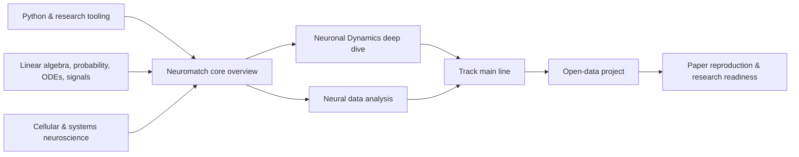

Computational neuroscience is not "applying deep learning to brain data," nor is it merely "simulating a lot of neurons." It studies how the nervous system represents, transforms, learns, and uses information across scales, and it tests theories using mathematical models, statistical inference, simulation, and experimental data.

| Scale | Typical questions | Common models/math | Common data |
|---|---|---|---|
| Ion channels, dendrites, single cells | How do action potentials arise? How do dendrites integrate inputs? | Circuits, ODE/PDE, Hodgkin–Huxley, multi-compartment models | Patch clamp, morphological reconstruction |
| Synapses and local circuits | How do E/I balance, oscillations, and plasticity arise? | LIF/AdEx, stochastic processes, network simulation, mean field | Multielectrode arrays, Neuropixels, calcium imaging |
| Populations and systems | How are stimuli, actions, and choices encoded by population activity? | GLM, Bayes, state-space models, dimensionality reduction, dynamical systems | Spikes, LFP, ECoG, 2-photon |
| Behavior and cognition | What computations underlie perception, decision-making, learning, and memory? | DDM, RL, HMM, optimal control, RNN | Behavior, eye movements, neural activity |
| Regional/whole-brain | How does structural connectivity constrain whole-brain dynamics? | Graph theory, neural mass models, network control, generative models | EEG/MEG, fMRI, dMRI, connectomes |
| NeuroAI | What computational principles are shared between natural and artificial intelligence? | ANN/RNN/Transformer, representational comparison, benchmarks | Model activations, neural and behavioral data |

### 1.1 Three complementary perspectives

- **Normative (why)**: why should the system adopt a particular computation? E.g., optimal estimation, Bayesian inference, reward maximization.
- **Algorithmic/representational (what)**: how does input become output, and in what variables is information represented? E.g., population code, state-space, RL update.
- **Mechanistic/implementational (how)**: how do cells, synapses, and circuits implement this computation? E.g., recurrent attractor, E/I circuit, plasticity rule.

Good projects clearly state which level they operate at, and what conclusions they can and cannot support.

### 1.2 Dependency relationships

