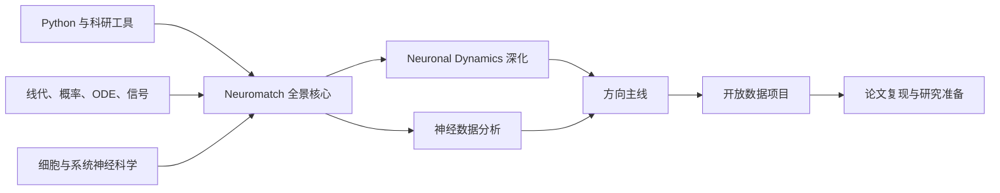

计算神经科学不是“把深度学习用在脑数据上”，也不只是“模拟很多神经元”。它研究神经系统在不同尺度上如何表示、变换、学习和使用信息，并用数学模型、统计推断、仿真和实验数据检验理论。

| 尺度 | 典型问题 | 常用模型/数学 | 常见数据 |
|---|---|---|---|
| 离子通道、树突、单细胞 | 动作电位如何产生？树突如何整合输入？ | 电路、ODE/PDE、Hodgkin–Huxley、多室模型 | patch clamp、形态重建 |
| 突触与局部回路 | E/I 平衡、振荡、可塑性如何产生？ | LIF/AdEx、随机过程、网络仿真、均场 | 多电极、Neuropixels、钙成像 |
| 群体与系统 | 刺激、动作、选择如何由群体活动编码？ | GLM、Bayes、状态空间、降维、动力系统 | spikes、LFP、ECoG、2-photon |
| 行为与认知 | 感知、决策、学习和记忆采用什么计算？ | DDM、RL、HMM、最优控制、RNN | 行为、眼动、神经活动 |
| 区域/全脑 | 结构连接如何约束全脑动态？ | 图论、neural mass、网络控制、生成模型 | EEG/MEG、fMRI、dMRI、连接组 |
| NeuroAI | 自然与人工智能共享什么计算原则？ | ANN/RNN/Transformer、表征比较、benchmark | 模型激活、神经与行为数据 |

### 1.1 三个互补视角

- **规范性（why）**：系统为什么应采用某种计算？例如最优估计、Bayesian inference、reward maximization。
- **算法/表征（what）**：输入怎样变成输出，信息以什么变量表示？例如 population code、state-space、RL update。
- **机制/实现（how）**：细胞、突触与回路怎样实现该计算？例如 recurrent attractor、E/I circuit、plasticity rule。

优秀项目会明确自己处于哪一层，并说明它能与不能支持什么结论。

### 1.2 依赖关系

